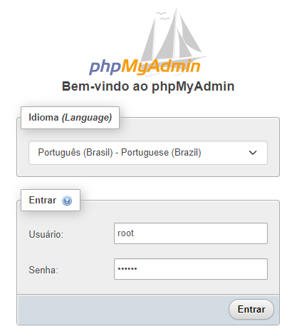

<p align="center" width="100%">
     
</p>


<h3 align="center">
  Desafio Backend: Criptografia
</h3>

<p align="center">

  
  
  

</p>

Resolução do desafio proposto pelo repositório Backend Brasil, confira detalhes [neste link](https://github.com/backend-br/desafios/blob/master/cryptography/PROBLEM.md).


# Sumário

+ [1 - Tecnologias utilizadas](#tecnologias-utilizadas)
+ [2 - Entenda o desafio](#entenda-o-desafio)
+ [3 - Como interagir com o banco de dados?](#como-interagir-com-o-banco-de-dados)
+ [4 - Como interagir com a API?](#como-interagir-com-a-api)
+ [5 - Desenvolvimento](#desenvolvimento)
+ [6 - Construção](#construção)
+ [7 - Contribuições](#contribuições)
+ [8 - Links](#links)
+ [9 - Exemplos de Uso](#exemplos)


## Tecnologias utilizadas

* Java 21
* Spring Boot
* Criptografia
* Jasypt
* MySQL
* Docker
* OpenAPI

## Entenda o desafio

Leio o [readme](PROBLEM.md) do problema.

## Como interagir com o banco de dados?
- Utilizamos o [MySQL](https://www.mysql.com/) + [phpMyAdmin](https://www.phpmyadmin.net/)

Acesse a pasta docker, abra o prompt e digite o comando:

```
docker-compose up -d
```

Irá subir o banco de dados MySQL + phpMyAdmin.
Para acessar o phpMyAdmin, acesse: http://localhost:8081/

usuário: root

senha: 123456




## Como interagir com a API?
- Utilizamos o [Postman](https://www.postman.com/) - para realizar as requisições.
- O projeto tem a dependência da OpenAPI Swagger, subindo o projeto você pode fazer as requisões pela url: http://localhost:8080/swagger-ui/index.html

## Desenvolvimento

Para iniciar o desenvolvimento, é necessário clonar o projeto do GitHub num diretório de sua preferência:

```shell
cd "diretorio de sua preferencia"
git clone https://github.com/erichiroshi/desafio-backend-cryptography
```

## Construção

Para construir o projeto com o Maven, executar os comando abaixo:

```shell
mvn clean install
ou
.\mvnw clean install 
```

O comando irá baixar todas as dependências do projeto e criar um diretório *target* com os artefatos construídos, que incluem o arquivo jar do projeto. Além disso, serão executados os testes unitários, e se algum falhar, o Maven exibirá essa informação no console.

## Contribuições

Contribuições são sempre bem-vindas! Para contribuir lembre-se sempre de adicionar testes unitários para as novas classes com a devida documentação.

## Links
[Link do desafio](https://github.com/backend-br/desafios/blob/master/cryptography/PROBLEM.md).

## Exemplos
### 📨 Requisições

| Método | Url | Descrição | Corpo da requisição |
| --- | --- | --- | --- |
| POST | /transactions | Crie uma nova transação. | [JSON](#criartransacao) |
| GET | /transactions | Busque todas transações paginada. | |
| GET | /transactions/{id} | Busque uma transação por id. | |
| PUT | /transactions/{id} | Atualiza o valor da transação por id. | [JSON](#atualizartransacao) |
| DELETE | /transactions/{id} | Apague uma transação por id. | |
---
### 📄 Corpo das requisições

##### <a id="criartransacao">/transactions - Criando uma nova transação.</a>

```json
{
  "userDocument": "document",
  "creditCardToken": "credit card token",
  "value": 100 
}
```

##### <a id="atualizartransacao">/transactions/{id} - Atualizando uma transação.</a>

```json
{
  "value": 50 
}
```


## Developed by Eric Hiroshi
